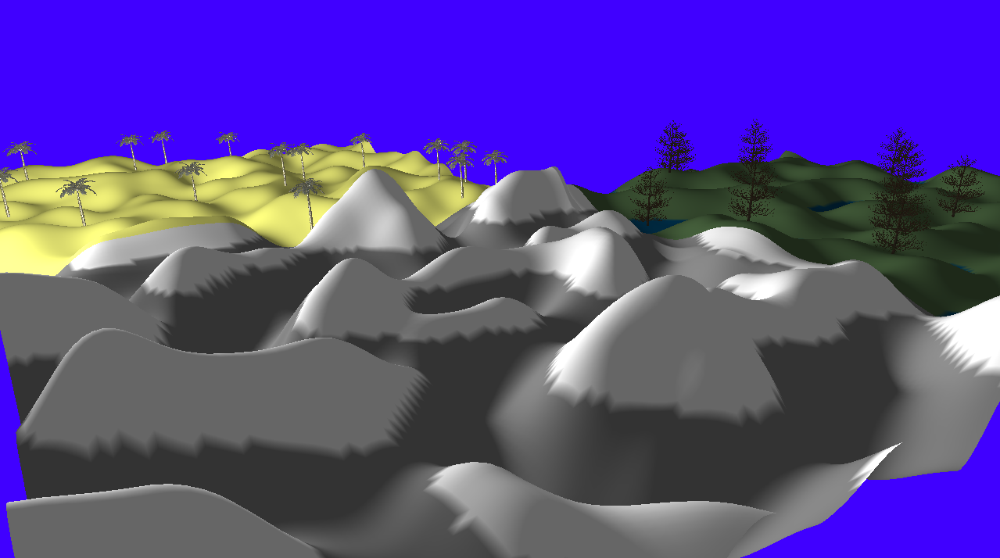
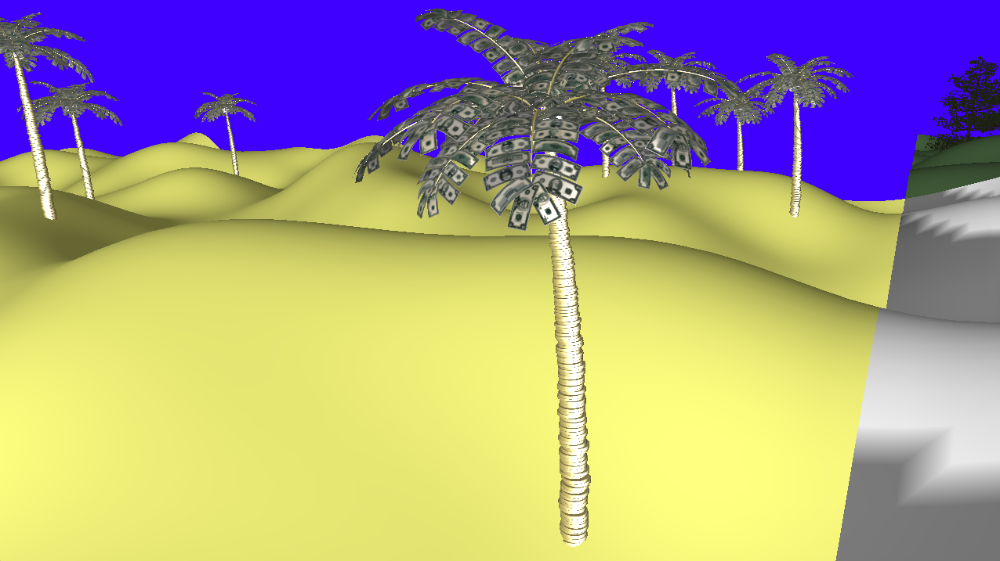
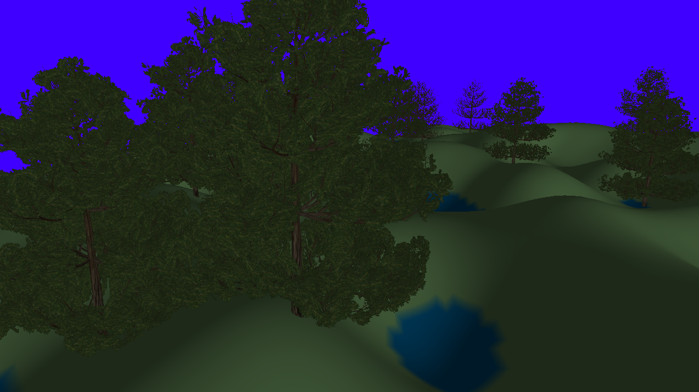
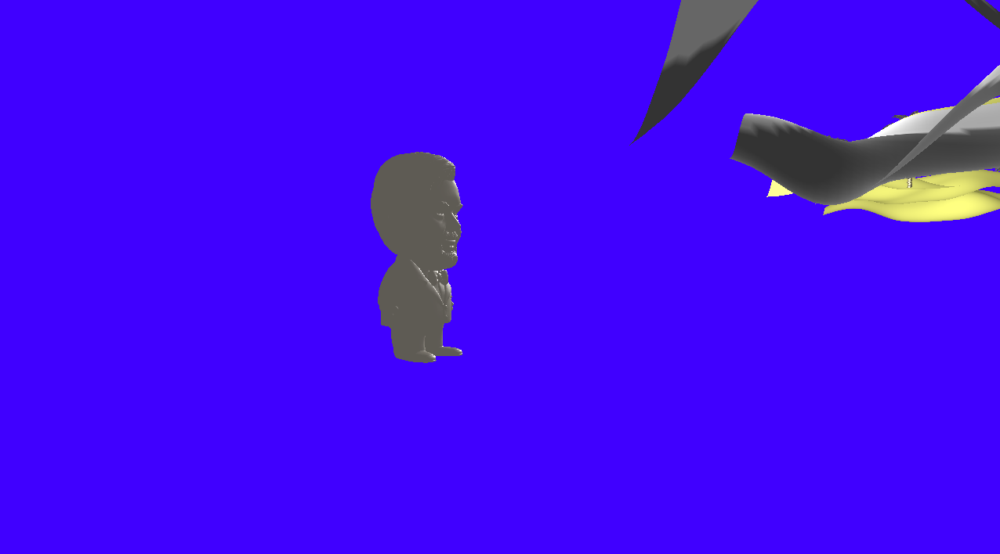

# COMP3016CW2

## Instructions
To run executable extract COMP3016CW2 exe and run COMP3016OpenGLScene.exe 
For source code extract COMP3016CW2 and click on COMP3016OpenGLScene.sln  
model.h from learnopengl has been changed as shown in Lab 9 e - Rock model files on the dle at 1:08

## Dependencies used
glfw3.lib,
glfw3_mt.lib,
glfw3dll.lib,
opengl32.lib,
assimp-vc143-mt.lib  
Include directories: 
Public/OpenGL/include with GL, glad, GLFW, glm, KHR and learnopengl  
Public/Asspim/Binaries/include  
Library directories: 
Public/OpenGL/lib  
Public/Assimp/Binaries/lib/Release
## Description
In the scene I have created there are three biomes. There is a mountain, desert and forest where the desert has palm trees made of money and gold and the forest has some regular trees. The palm trees have a roughness and metallic texture mixed with the base colour so that the lighting give a better effect. This is mostly for the specular lighting to make the gold shine while the money leave do not. The mountains biome has a larger height variation and has snow on the highest parts while the forest biome has a lower heigh variation and has water at the lowest parts. For the signature there is a model of what JD Vance looked like in south park under the mountains biome. There is WASD and mouse controls to move around the scene.

## Use of AI
I have used AI to explain OpenGL concepts to me in order to get a better understanding on how to approach what I am trying to achieve. I also used it to debug some issues such as when I was trying to render the tree model in the forest and the transparent pixels of the leaves were being rendered as black pixels or when I turned the terrain generation into a class and was trying to use it to generate different biomes as separate chunks. When I was adding in the models to fill up the biomes I used it to generate locations to put into the DrawModel method I had created instead of writing it many times over myself.

## Game programming patterns
Game loop - The game gets user input and moves the camera position. 
Update method - The terrain and models are drawn every frame. 
OOP - The terrain was turned into a class so that the method used to create it can be used many times for different biomes and each biome can have an offset so that they don't overlap.

## Sample Screens
### Full View

### Money Tree

### Forest Tree

### Signature

## Exception handling
Before the scene renders it checks if GLFW has been initialised and will show an error in the console if it has not and will not continue to run.

## Evaluation
I have created a scene with three biomes and rendered some models and given them correct lighting which you can explore using WASD and the mouse. If I were to do this again I would try to find a way to add animations into my scene as this time they would either be black and do nothing or the debug assertation would fail. I would also try to add background music as I would have more time left over to spend on that now that I know what I do. I would also try to batch render the models as it would reduce the load on the GPU.
